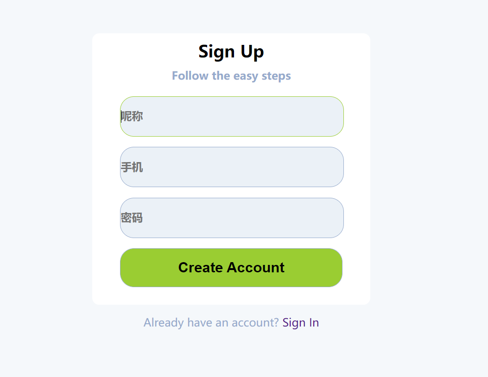
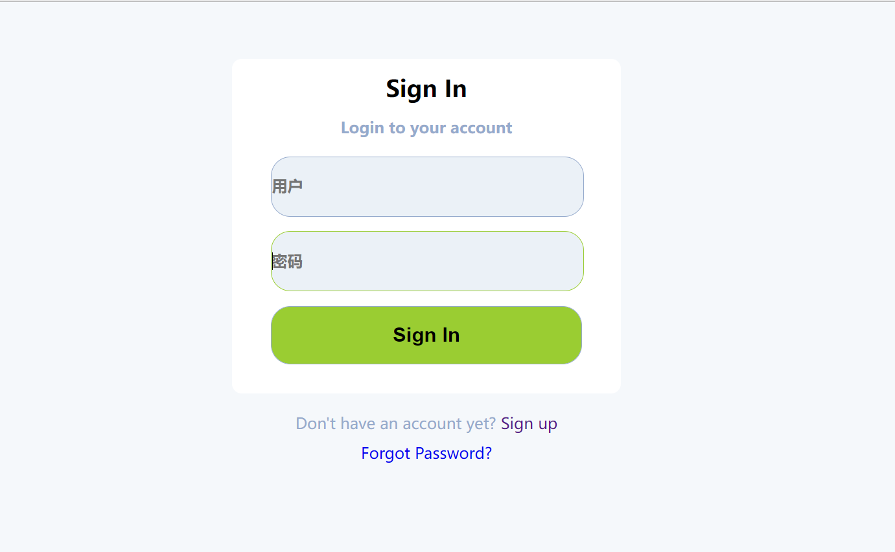
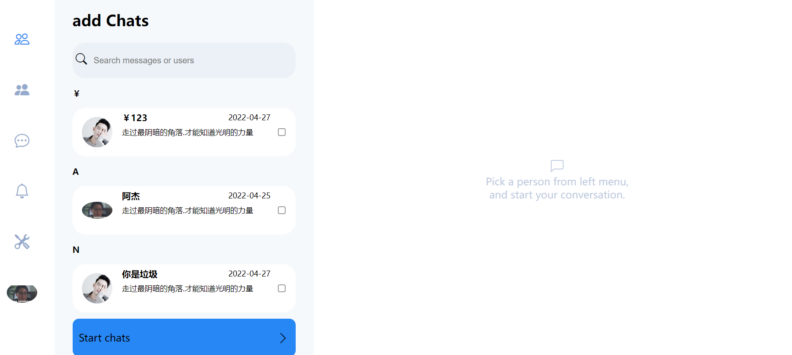
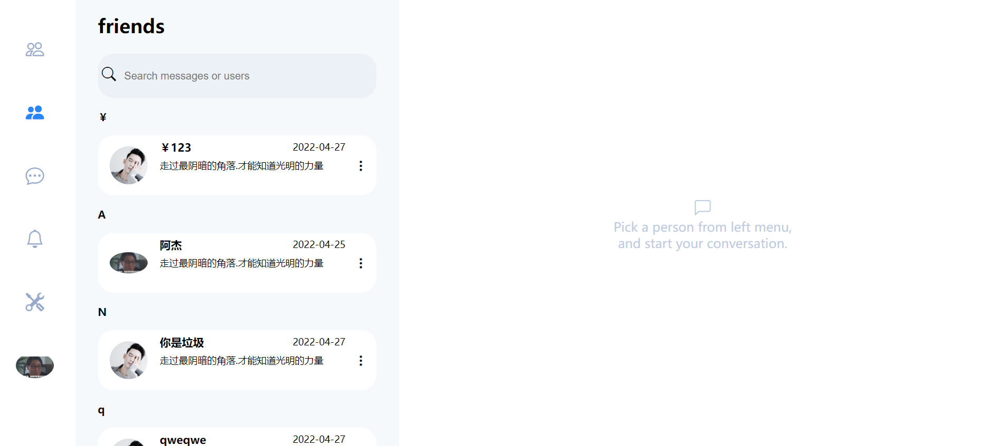
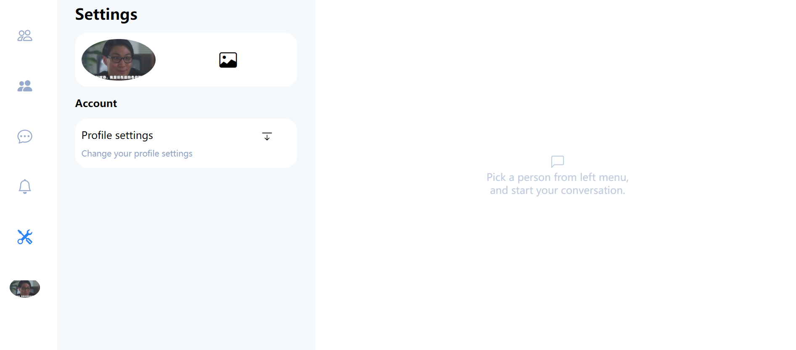
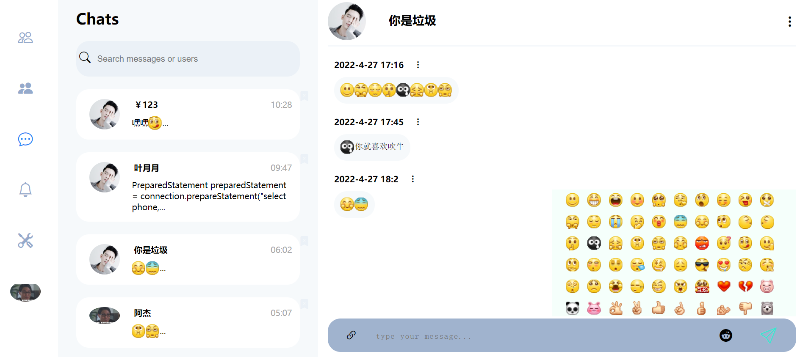
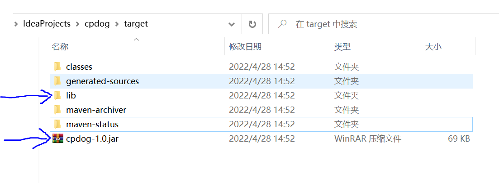

# cpdog

#### 介绍
H5开源web聊天,目前已经完成了用户的注册、登录、添加好友、删除好友、

查询好友、添加聊天、显示聊天、上传用户图片、修改用户备注功能、

下一步准备设计通知机制.就目前的话比如说一个用户给你发了信息.现在默认是不会

自动接收到的.没有通知机制.需要刷新页面.或者点击聊天、才能查到最新的信息通知.

和后端数据交互使用的是websocket .前后端信息交互主要使用json格式.上传文件使

用的是自定的规则...

自定义的前后端JSON数据交互协议例:

```js
const queryCurrentFriends ={
    uuid:"",
    url:"queryUsersFriends",
    src:"queryUsersFriends",
    tar:"queryUsersFriends",
    charts:{
        nikeName:"",
        currentPage:1,
        totalPage:1,
        currentActiveId:"m1-friends",
        tokenSession:websktoken
    }
}
```

#### 线上测试地址
http://www.kungreat.cn/
#### 详细介绍地址
https://space.bilibili.com/384704339
#### 界面图

**<u>注意目前只做了pc端css布局、只支持宽900px像素以上的设备浏览访问.</u>**

1. 注册界面
2. 登录 
3. 用户查询

4.好友列表

5.用户设置 支持选择图片上传 和拖拉 上传图片



6.聊天区域



#### 软件架构

软件架构说明
基于Reactor 设计模式、使用原生java-nio实现的websocket 通信框架.

完全基于NIO实现.最少的包装、协议的解释、数据的传输、尽量少的第三方依赖、

[mysql、jackson、HikariCP、logback]

使用mysql数据库.jackson前后端数据交互.HikariCP数据库连接池.logback日志体系

#### 安装教程

1. 下载此项目源代码.

2. 初始化数据库表结构.sql脚本在 resources 下的mysql.txt

3. 修改cpdog.properties 配置相关的属性.用户存放图片地址要放在一个前端服务器

   的目录.后端接收到图片数据后会传到此目录下.

4. 扫描包路径  是后端服务接收到前端的请求数据标识后作一个后端方法的映射调用.

   如果不指定就默认从当前主方法的目录往下扫描.[请观看services包下的类.就是会扫描的

   类配置.后端接收到前端数据后.会根据前端传入的url解释对比后端的指定类的方法

   匹配后反射调用.有优先级.]

5. 修改logback.xml 日志文件配置、注意初始化  [日志文件存放路径]

6. 启动.可以通过开发工具打开**CpdogMain** 主方法启动. BOSS线程一个只接收连接.

   有连接后就把任务分配给WORK去完成.**new** **NioWorkServerSocket**[12];

   12就是你要创建的WORK对象的数量也就是多少个线程来工作

   可以通过setOption 来设置NIO的SOCKET

   也可以通过maven 打成JAR包执行.打成的JAR包目录下有个lib、需要这二个才可以运行.

   lib就是依赖的第三方JAR包存放的目录.在生成的JAR包时的MF文件里已经关联上了.

   只需要把它们放在一个目录下就可以执行

   

#### 使用说明

1.   需要配合前端使用.
2.  https://gitee.com/mydreams2018/dwbbs

#### 参与贡献

1.  Fork 本仓库
2.  新建 Feat_xxx 分支
3.  提交代码
4.  新建 Pull Request


#### 特技

1.  使用 Readme\_XXX.md 来支持不同的语言，例如 Readme\_en.md, Readme\_zh.md
2.  Gitee 官方博客 [blog.gitee.com](https://blog.gitee.com)
3.  你可以 [https://gitee.com/explore](https://gitee.com/explore) 这个地址来了解 Gitee 上的优秀开源项目
4.  [GVP](https://gitee.com/gvp) 全称是 Gitee 最有价值开源项目，是综合评定出的优秀开源项目
5.  Gitee 官方提供的使用手册 [https://gitee.com/help](https://gitee.com/help)
6.  Gitee 封面人物是一档用来展示 Gitee 会员风采的栏目 [https://gitee.com/gitee-stars/](https://gitee.com/gitee-stars/)
